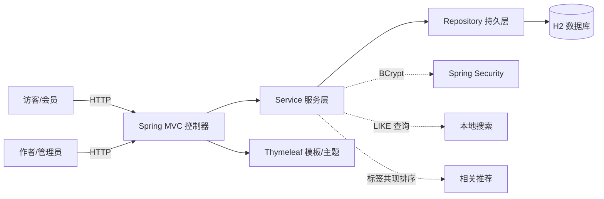

# 轻博客（oss-blog）

一个可注册、可写作、可评论、可搜索的个人博客系统。本项目是《开源软件与新技术》实验 1
「开源个人博客系统二次开发」的交付成品：以 RealWorld 博客业务规范为基线，使用
Java / Spring Boot 独立实现，并在其之上完成主题定制、本地搜索、相关推荐等可辨识的二次开发。

## 一句话简介

用 Spring Boot + Thymeleaf + H2 实现的服务端渲染博客：访客可浏览/搜索，会员可注册/评论，
管理员可发布/编辑文章，支持标签浏览、关键词高亮、相关推荐与数据持久化。

## 目标用户与问题场景

- 目标用户：课程教师（复核）、普通访客、注册会员、博客作者（管理员）。
- 问题场景：需要一个不依赖外部服务、本地即可复现的轻量博客，覆盖「身份 / 内容 / 分类 / 评论 / 检索」
  五类典型 Web 子系统，用于演示开源二次开发的完整过程。

## 功能清单

- 前台：首页文章列表、文章详情、按标签浏览、关键词搜索（标题+正文、结果高亮、无结果提示）。
- 认证：注册（重名/邮箱重复/两次密码不一致校验）、登录（错误有明确提示）、登出。
- 权限：`/admin/**` 仅管理员；评论需登录；匿名访问受限资源跳转登录页。
- 写作：管理员创建、编辑、删除文章；文章关联标签、支持草稿/发布、精选标记。
- 评论：登录会员可评论，匿名被拦截。
- 数据：文件型 H2 持久化，重启后文章与评论仍存在；首次启动注入演示数据。
- 二次开发：自定义主题（马卡龙色卡片式 + 响应式布局）、本地全文搜索 + 高亮、按「共享标签数 + 时间」的相关推荐。

## 技术栈与系统架构

- 语言/字节码：Java 17（`options.release = 17`）
- 框架：Spring Boot 4.1.1、Spring MVC、Spring Security、Spring Data JPA、Jakarta Validation
- 视图：Thymeleaf（服务端渲染）+ 自定义 CSS
- 数据库：H2（开发环境文件模式 `./data/blogdb`，测试环境内存模式）
- 构建：Gradle 9.7.1（`io.spring.dependency-management` 1.1.7）
- 测试：JUnit 5、MockMvc、Spring Security Test



分层结构：

```
src/main/java/com/example/blog
├── model       领域实体（User/Post/Tag/Comment/Role）
├── repository  Spring Data JPA 接口
├── service     业务逻辑（认证/文章/标签/评论/搜索/推荐）
├── dto         表单对象（RegistrationForm/PostForm/CommentForm）
├── controller  MVC 控制器（前台/认证/后台）
├── config      SecurityConfig / GlobalControllerAdvice / DataSeeder
└── util        BlogUtils / SlugUtil
src/main/resources
├── templates   自定义主题模板（Thymeleaf）
├── static/css  主题样式（马卡龙色 + 响应式）
└── application.properties
```

## 环境要求与版本检查

| 依赖 | 要求 | 检查命令 |
| --- | --- | --- |
| JDK | 17 及以上（编译目标 17） | `java -version` |
| Gradle | 本项目通过 wrapper 固定 9.7.1 | `gradlew.bat --version` |

> 本机实测使用 JDK 23 向下编译到 17 字节码。锁文件为 `gradle/wrapper/gradle-wrapper.properties`
> 与 `build.gradle`，未写“最新版”。

## 安装、初始化、运行与停止

Windows（PowerShell）示例，Linux/macOS 将 `gradlew.bat` 换成 `./gradlew`。

```powershell
# 1. 编译并运行测试（可选）
.\gradlew.bat test

# 2. 启动（默认端口 8080，数据库落在 ./data/blogdb）
.\gradlew.bat bootRun
```

启动后访问：

- 前台：http://localhost:8080/
- 登录：http://localhost:8080/login
- 注册：http://localhost:8080/register
- 管理端：http://localhost:8080/admin（仅管理员）

停止：在运行 `bootRun` 的终端按 `Ctrl+C`。

## 演示账号与最小演示数据

首次启动自动注入（见 `DataSeeder`，仅当用户表为空时执行）：

| 账号 | 密码 | 角色 |
| --- | --- | --- |
| admin | admin123 | ADMIN（管理员） |
| member | member123 | MEMBER（会员） |

- 8 篇演示文章、3 个标签（Java、Spring、开源）。
- 中文搜索演示词：`微服务`（命中《微服务架构入门与适用边界》）。
- 文章覆盖：长标题、无封面图、代码块、中文搜索词、空评论等边界情况。

## 完整 Demo 流程

1. 打开 http://localhost:8080/ 浏览首页与文章卡片。
2. 用 `member / member123` 登录，搜索 `微服务`，验证中文命中与高亮。
3. 用 `admin / admin123` 登录，进入 `/admin` 发布一篇带标签的新文章。
4. 返回前台查看文章，用会员账号发表评论。
5. 打开文章详情页查看底部「相关推荐」（自主扩展功能）。
6. 访问 `/search?q=一个不存在的词`，验证无结果提示。
7. 重启应用，确认文章与评论仍在（文件型 H2）。

## 二次开发内容（与上游基线差异）

本项目以 RealWorld 博客业务规范（`realworld-apps/realworld` 的 `specs/api`、`specs/e2e`）
为业务基线，**未克隆或复用第三方实现代码**，而是用 Spring Boot 独立实现等价的注册/登录/
文章/标签/评论主流程，因此不涉及固定第三方实现 Commit。作为二次开发，可辨识的增量包括：

1. **自定义主题**：`src/main/resources/templates` + `static/css/style.css`，马卡龙色卡片式、
   响应式（820px / 520px 断点）布局，与默认 Spring Boot 空白页形成明显差异。
2. **本地全文搜索**：`PostRepository.searchPublished`（标题+正文大小写不敏感 LIKE），
   控制器预处理关键词高亮（`<mark>`），无结果有明确提示。
3. **相关推荐**（自主扩展功能）：`PostService.related` 按「共享标签数量 + 发布时间」排序，
   排除自身，输出到文章详情页，且带阅读时长。

不修改框架核心；改动边界限定在控制器、服务、模板与样式，便于升级与回滚。

## 测试方法与结果

```powershell
.\gradlew.bat test
```

- 测试用例数：21，全部通过。
- 覆盖：注册/登录成功与失败、文章列表、标签筛选、中文搜索命中/无结果、匿名/会员/管理员的
  权限边界、管理员创建文章、空标题校验、会员评论、匿名评论拦截、阅读时长、相关推荐。
- 测试用例明细见 `tests/acceptance.md`。

## 已知问题与局限

- 搜索采用数据库 `LIKE` 模糊匹配，适合小规模中文内容；数据量很大时需引入全文索引。
- 本演示关闭了 CSRF（见 `SecurityConfig`），仅用于本地演示，生产需重新开启并适配表单 Token。
- 文件型 H2 数据落在 `./data/`（已加入 `.gitignore`），不提交数据库、日志或密钥。

## 安全注意事项与敏感配置处理

- 密码使用 BCrypt 存储，不保存明文；演示账号仅用于本地教学，不提交真实密码。
- `data/`、`logs/`、`*.log`、`*.mv.db`、`*.trace.db` 已加入 `.gitignore`。
- 未在仓库中提交任何 Token、密钥或数据库口令。

## 主要功能截图

提交材料中单独存放运行截图（首页、登录、管理端、文章详情+评论、搜索结果、相关推荐）。
运行后建议截取上述界面作为证据，不以前端截图代替可运行成品。

## 上游项目与第三方资源

- RealWorld 规范仓库：https://github.com/realworld-apps/realworld （业务规范与测试思路来源）
- Spring Boot / Spring Security / Spring Data JPA：Apache-2.0
- Thymeleaf：Apache-2.0
- H2 Database：EPL 1.0 / MPL 2.0
- 详见 `NOTICE.md`。

## 个人开发记录与贡献证据

使用 Git 管理：Feature Branch + Commit + PR 流程；提交记录覆盖基线、核心功能、自主功能、
测试与文档（详见 Git 历史与 `git log --oneline --graph`）。自审记录与 Issue 说明见 `tests/acceptance.md`
及提交信息。
