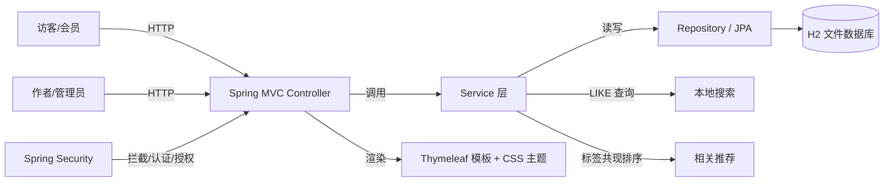

# 系统架构说明

## 总体架构

## 一次请求的完整路径（以「搜索」为例）

1. 浏览器发起 `GET /search?q=微服务`。
2. `Spring Security` 过滤器链判断 `/search` 属于公开资源，放行。
3. `DispatcherServlet` 路由到 `HomeController.search`。
4. 控制器调用 `PostService.search`，`PostService` 调用 `PostRepository.searchPublished`。
5. `PostRepository` 通过 Spring Data JPA 执行 `LIKE` 查询，命中 H2 中的 `posts` 表。
6. 控制器对命中的标题/摘要做关键词高亮（`BlogUtils.highlight`），组装 `results`。
7. 模型交给 Thymeleaf 渲染 `search.html` 主题模板，返回 HTML。

## 关键目录说明

| 目录/文件 | 作用 |
| --- | --- |
| `src/main/java/com/example/blog/model` | 领域实体与关系映射（User/Post/Tag/Comment/Role） |
| `src/main/java/com/example/blog/repository` | Spring Data JPA 接口，含搜索 `@Query` |
| `src/main/java/com/example/blog/service` | 业务逻辑：认证、文章、标签、评论、搜索、相关推荐 |
| `src/main/java/com/example/blog/controller` | MVC 控制器：前台、认证、后台 |
| `src/main/java/com/example/blog/config` | SecurityConfig、GlobalControllerAdvice、DataSeeder |
| `src/main/resources/templates` | 自定义主题模板（二次开发主要边界之一） |
| `src/main/resources/static/css` | 主题样式（马卡龙色、响应式） |
| `src/main/resources/application.properties` | 运行配置（端口、数据库、JPA） |
| `src/test` | 自动化测试（主流程、权限、自主功能） |
| `data/`（运行时生成） | H2 文件数据库，**不提交** |
| `docs/`、`tests/` | 架构说明与测试记录 |

## 允许修改 vs 禁止修改

允许修改（二次开发边界）：

- `templates/**`、`static/**`：主题与界面。
- `controller/**`、`service/**`、`dto/**`、`util/**`：业务与交互逻辑。
- `config/DataSeeder.java`：演示数据。
- `repository/**` 中新增查询方法。

禁止修改：

- 依赖框架本身（Spring Boot / Spring Security / Thymeleaf / Hibernate 源码）。
- `data/`、`logs/` 运行时生成数据（不应进入版本库）。
- 任何密钥、口令或用户隐私数据。

## 数据持久化与恢复

- 开发环境：`jdbc:h2:file:./data/blogdb;AUTO_SERVER=TRUE`，重启后数据仍在。
- 恢复：备份 `./data` 目录，冷启动后重新指向该目录即可恢复文章/标签/评论。
- 测试环境：`jdbc:h2:mem:blogtest`，`create-drop`，每次全新。
